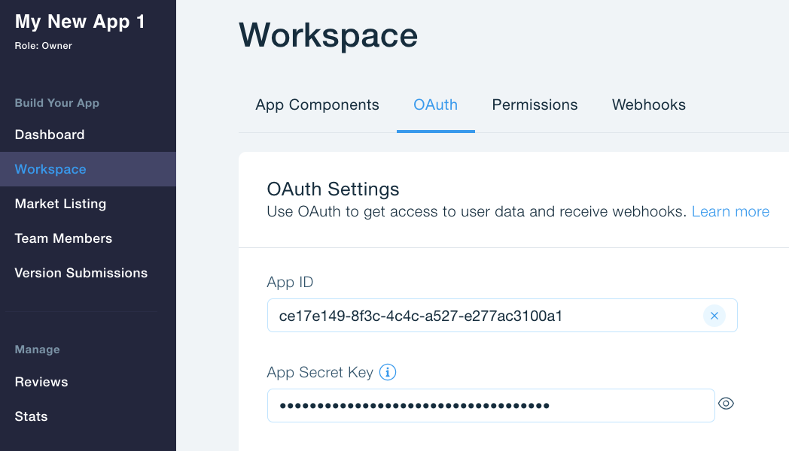

# Wix Bookings List - Sample Application
 to - [Wix Developers](https://dev.wix.com/dc3/my-apps)
1. Click on "Create New App"
1. Go to Workspace -> OAuth and copy your `App ID` and `App Secret Key`. You will need them later.

1. 